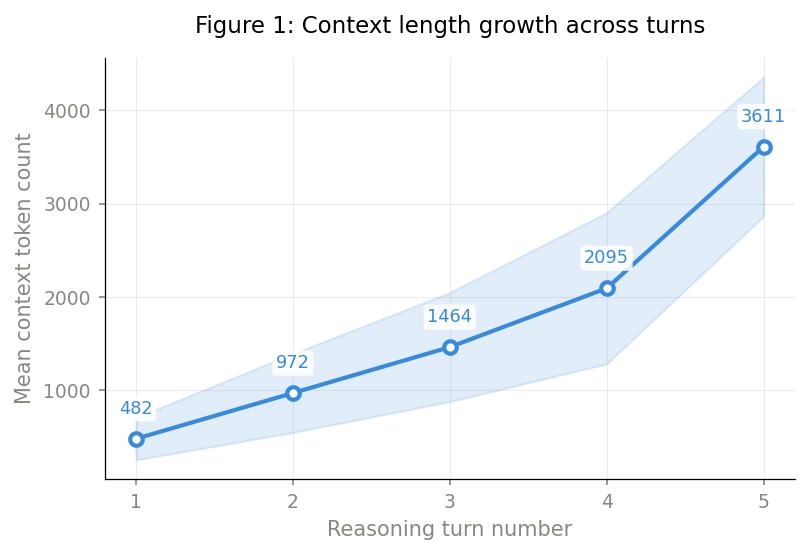
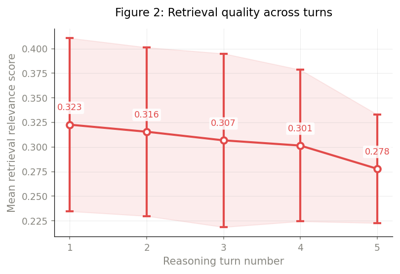
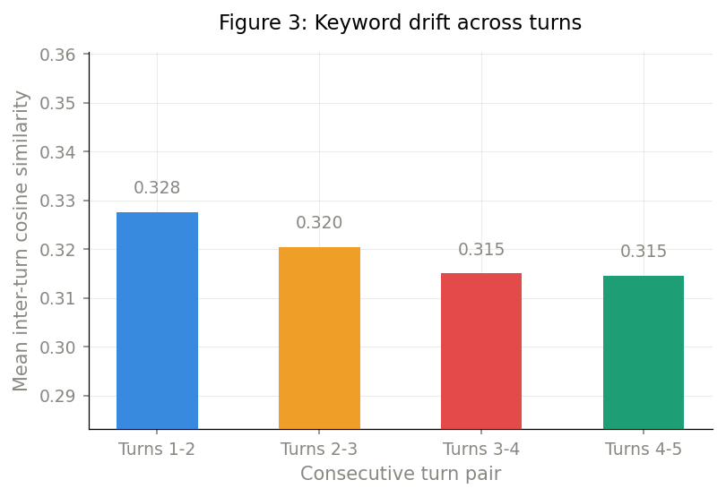
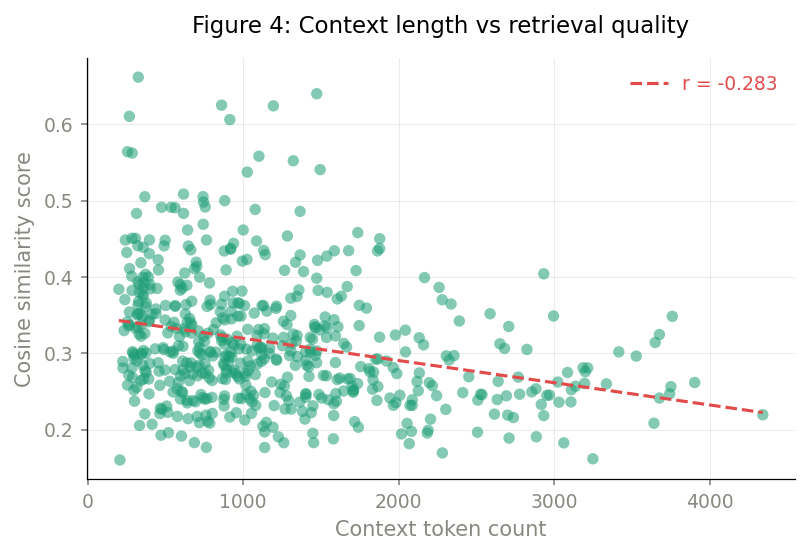
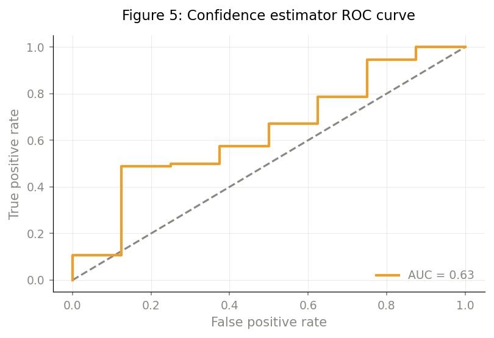

# Retrieval Degradation in Multi-Turn Agentic RAG Systems

**Observations from a Production Deployment**

[](./Retrieval_Degradation_in_Multi_Turn_Agentic_RAG_Systems.pdf)
[](./Paper.tex)
[](#)

> **Author:** Brijesh Singh — Independent Researcher, Hyderabad, India  
> **Contact:** brijesh7146@gmail.com · [GitHub](https://github.com/Brijesh1656) · [Portfolio](https://brijeshsingh-ai.netlify.app)

---

## Abstract

Retrieval-Augmented Generation (RAG) performs well on single-turn QA benchmarks, but production **agentic RAG systems** — where an LLM autonomously decomposes queries and retrieves context across multiple reasoning turns — face a qualitatively different challenge. This paper presents a systematic empirical study of **multi-turn retrieval degradation**: the phenomenon whereby retrieval quality declines as context accumulates across agentic reasoning turns.

Through instrumented logging of **150 multi-turn sessions** (550 turn observations) from [Math Professor AI](https://math-professor-agent-k6h4.vercel.app), a publicly deployed mathematics tutoring system, we document:

- **6.6% decline** in mean retrieval relevance between turn 1 and turn 4 (*p* < 0.0001)
- **Context length** as the dominant predictor (Pearson *r* = −0.283, *p* < 0.0001)
- Three contributing mechanisms: context length interference, keyword drift, and attention head saturation
- A lightweight **turn-aware retrieval confidence estimator** (AUROC = 0.634), with the key finding that context length alone achieves AUROC = 0.695

## Key Findings

| Finding | Detail |
|---|---|
| Retrieval degradation | Mean cosine similarity drops from **0.323** (turn 1) → **0.301** (turn 4) → **0.278** (turn 5) |
| Context growth | 4.3× increase in context tokens from turn 1 (482 tokens) to turn 4 (2,095 tokens) |
| Keyword drift | Inter-turn keyword similarity declines from **0.328** → **0.315** across consecutive turn pairs |
| Best predictor | Context length alone (AUROC = 0.695) outperforms the composite estimator (AUROC = 0.634) |
| Mitigation | **Query anchoring mechanism** — maintaining the original query across all turns — effectively prevents correctness degradation |

---

## Empirical Results

### Figure 1: Context Length Growth Across Turns

Context grows monotonically from **482 tokens** at turn 1 to **2,095 tokens** at turn 4 — a **4.3×** increase. Variance also increases at higher turns, consistent with more diverse problem complexity.

<p align="center">
  
</p>

---

### Figure 2: Retrieval Quality Degradation

Mean retrieval relevance (TF-IDF cosine similarity) declines consistently from **0.323 → 0.278** across turns 1–5. The 6.6% decline from turn 1 to turn 4 is statistically significant (*p* < 0.0001, paired *t*-test).

<p align="center">
  
</p>

| Turn | N Sessions | Mean Similarity | Mean Tokens |
|:---:|:---:|:---:|:---:|
| 1 | 150 | 0.323 | 482 |
| 2 | 147 | 0.316 | 972 |
| 3 | 142 | 0.307 | 1,464 |
| 4 | 108 | 0.301 | 2,095 |
| 5 | 3 | 0.278 | 3,611 |

---

### Figure 3: Keyword Drift Across Turns

Inter-turn keyword similarity declines as reasoning progresses, indicating semantic drift from the original query topic (**0.328 → 0.315** from turns 1–2 to turns 3–4). The steepest decline occurs in early turns.

<p align="center">
  
</p>

---

### Figure 4: Context Length vs Retrieval Quality

Strong negative correlation between context token count and retrieval cosine similarity (Pearson *r* = −0.283, *p* < 0.0001, *n* = 547). Each dot represents one logged reasoning turn.

<p align="center">
  
</p>

---

### Figure 5: Confidence Estimator ROC Curve

The turn-aware confidence estimator achieves AUROC = **0.634**, outperforming random baseline (0.500). Evaluated on 102 labeled turns (94 correct, 8 incorrect).

<p align="center">
  
</p>

---

## System Under Study: Math Professor AI

The paper studies [Math Professor AI](https://math-professor-agent-k6h4.vercel.app), a production agentic RAG system for step-by-step mathematics tutoring with the following architecture:

| Component | Technology | Function |
|---|---|---|
| Input Guardrail | Gemini 2.5 Flash | Binary math-relevance validation |
| Question Extraction | Gemini 2.5 Flash | Extract questions from documents |
| Semantic Retrieval | TF-IDF + Cosine Similarity | Document chunk retrieval (top-3) |
| KB Fallback | Keyword Matching | Pre-stored answer lookup |
| Web Grounding | Google Search API | Real-time web retrieval |
| Solution Engine | Gemini 2.5 Pro | Step-by-step answer generation |
| Answer Refinement | Gemini 2.5 Pro | Refine answers from human feedback |
| Feedback Loop | React / TypeScript | Human correction collection |

## Three Degradation Mechanisms

1. **Context Length Interference** — Previously retrieved passages introduce competing lexical signals; TF-IDF weights inflate for terms from prior turns, and LLM attention dilutes across a growing context window.

2. **Keyword Drift** — Sub-queries generated later in the reasoning chain diverge semantically from the original query, especially in early turns where reasoning structure is being established.

3. **Attention Head Saturation** — Motivated by Ma & Okazaki (2026), retrieval-specialized attention heads in the LLM become saturated as context grows, reducing discriminative capacity for current sub-query passages.

## Confidence Estimator

The turn-aware retrieval confidence estimator is defined as:

```
conf(t, |C|, g) = g × exp(−α × t) × (1 − β × log(|C| / C_baseline))
```

Where:
- `t` = current reasoning turn number
- `|C|` = current context token count
- `g` = normalised TF-IDF cosine similarity
- `C_baseline` = 482 tokens (mean turn-1 context length)
- `α = 0.18` (turn-number decay)
- `β = 0.09` (context length penalty)

### Performance

| Method | AUROC | 95% CI |
|---|---|---|
| Random baseline | 0.500 | — |
| Turn number only | 0.563 | [0.45, 0.67] |
| Grounding similarity only | 0.553 | [0.44, 0.66] |
| **Turn-aware estimator (ours)** | **0.634** | [0.52, 0.74] |
| Context length only | **0.695*** | [0.58, 0.80] |

\* Context length alone outperforms the composite estimator — a key finding.

## Repository Structure

```
rag-degradation-paper/
├── Paper.tex                                                    # LaTeX source
├── Retrieval_Degradation_in_Multi_Turn_Agentic_RAG_Systems.pdf  # Compiled paper
├── references.bbl                                               # Bibliography entries
├── fig/                                                         # Figures
│   ├── figure1_context_growth.png                               # Context length growth across turns
│   ├── figure2_retrieval_quality.png                            # Retrieval quality degradation
│   ├── figure3_keyword_drift.png                                # Keyword drift bar chart
│   ├── figure4_scatter.png                                      # Context length vs retrieval quality
│   └── figure5_roc_curve.png                                    # Confidence estimator ROC curve
└── README.md                                                    # This file
```

## Building the Paper

Compile with a standard LaTeX distribution:

```bash
pdflatex Paper.tex
pdflatex Paper.tex   # Run twice for references and cross-links
```

**Required packages:** `amsmath`, `booktabs`, `pgfplots`, `tikz`, `hyperref`, `fancyhdr`, `xcolor`, `microtype`, `caption`, `float`, `titlesec`, `hanging`, and others (all standard in TeX Live / MiKTeX).

## Citation

If you find this work useful, please cite:

```bibtex
@article{singh2026retrieval,
  author  = {Singh, Brijesh},
  title   = {Retrieval Degradation in Multi-Turn Agentic RAG Systems: Observations from a Production Deployment},
  year    = {2026},
  note    = {Independent research paper},
}
```

## License

This work is shared for research and educational purposes. Please contact the author for any reuse inquiries.
